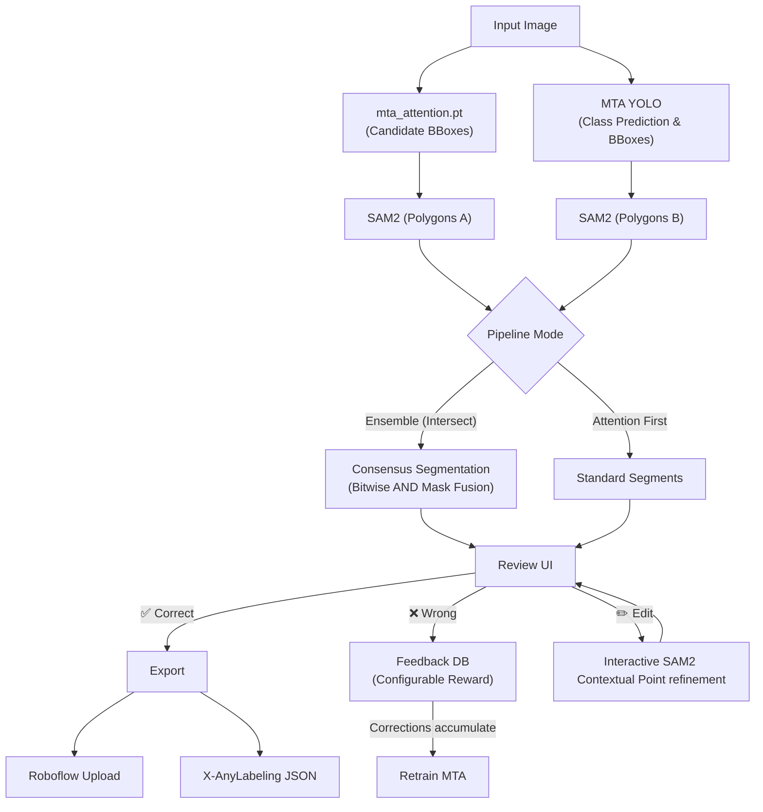

# Experimental attention-guided annotation pipeline for MTA waste segmentation

Note1: This is higly experimental to test and experiment the annotation pipeline
Note2: The constraint are made under GTX 1650 4GB VRAM, therefore it is advisable to switch to either larger model of SAM 2.1, or switch to SAM 3

## Summary

Built a complete **active learning annotation pipeline** that integrates:
- **SAM2** for highly-precise polygon segmentation (mask-to-polygon conversion)
- **MTA YOLO** model for trash class prediction (15 classes) and attention-based candidate generation
- **Consensus Segmentation** for strict pixel-level intersection and boolean mask fusion
- **Interactive Polygon Editing** with smart bounding box context and point-reversion failsafes
- **Active learning** with configurable reward/feedback tracking (+1/−1 system)
- **Roboflow** upload for dataset management
- **X-AnyLabeling** export for annotation refinement
- **Review UI** for human-in-the-loop quality control and real-time polygon smoothing

---

## Architecture



---

## Files Created (9 modules)

| File | Size | Purpose |
|------|------|---------|
| [config.py] | 5.3 KB | Central configuration (models, API keys, Pipeline Thresholds, Active Learning Rewards) |
| [sam2_segmentor.py] | 8.3 KB | SAM2 wrapper, mask→polygon via `cv2.findContours`, dynamic epsilon parsing |
| [mta_classifier.py] | 10.5 KB | MTA YOLO classifier, IoU-based polygon matching |
| [active_learning.py] | 20.8 KB | SQLite reward DB, feedback, sampling, export |
| [roboflow_uploader.py] | 7.4 KB | Roboflow API upload (single + batch) |
| [xanylabeling_export.py] | 7.9 KB | X-AnyLabeling JSON export + model config |
| [pipeline.py] | 16.5 KB | Core orchestration tying everything together, handles multi-model parsing and mask intersection |
| [review_ui.py] | 42.1 KB | CustomTkinter application with interactive editing and real-time parameter tuning |
| [run.py] | 8.3 KB | CLI entry point (5 modes) |

Also generated: [xanylabeling_config.yaml]

---

## Advanced Features

### Consensus Segmentation
A sophisticated ensembling mode (**Boolean Mask Fusion / Consensus Segmentation**). When selected, the pipeline:
1. Runs the attention model and the main YOLO classifier to get two sets of bounding box candidates.
2. Generates distinct SAM2 masks for both sets.
3. Finds overlapping candidate masks (IoU > `IOU_THRESHOLD_INTERSECT`) and applies a strict pixel-level intersection (`cv2.bitwise_and`).
4. Resulting polygons perfectly represent the agreed-upon intersection of both models. Uniquely found items are retained (Union).

### Interactive Polygon Editing
When reviewing a segment, clicking **✏️ Edit** triggers a smart interactive mode:
- **SAM2 Context Preservation:** The original bounding box of the selected polygon is retained. Left-clicks (add points) and right-clicks (subtract points) are passed to SAM2 alongside the bounding box, providing essential context to perfectly reshape the object.
- **Point Reversion Failsafe:** If a right-click accidentally corrupts the SAM2 prediction, causing it to lose the object entirely, the pipeline instantly rejects the click, displays a yellow warning, and safely preserves your previous polygon.

### Real-Time Smoothing Slider
A zero-latency **Smoothing** slider resides in the UI toolbar. It adjusts `POLYGON_SIMPLIFY_EPSILON` between `0.1` (hyper-precise) and `10.0` (coarse/blocky). Sliding it dynamically recalculates every polygon currently displayed on the image instantly without requiring a full model re-inference.

---

## How to Use

### 1. Launch the Review UI (Interactive Mode)
```bash
cd "mta-run"
python run.py
# or
python run.py --mode ui
```

This opens the review application where you can:
- Load images or folders
- Select Pipeline Mode (e.g., Attention First, Consensus Segmentation)
- Adjust real-time Polygon Smoothing (Precision slider)
- Toggle SAM2 on/off
- Click polygons to review them
- Accept/reject polygons (✅/❌) or interactively Edit them (✏️)
- Accept/edit class predictions
- View reward scores in real-time
- Export to X-AnyLabeling & Upload to Roboflow

### 2. Batch Processing
```bash
python run.py --mode batch --input ../gallery
python run.py --mode batch --input ../gallery --auto-approve
python run.py --mode batch --input ../gallery --no-sam2  # Use MTA masks only
```

### 3. View Dashboard
```bash
python run.py --mode dashboard
```

### 4. Export Corrections for Retraining
```bash
python run.py --mode export
```

### 5. Generate X-AnyLabeling Config
```bash
python run.py --mode config
```

---

## Active Learning Reward System

### How it Works

Each prediction goes through two review stages:

| Stage | ✅ Correct | ❌ Incorrect | ✏️ Edit |
|-------|-----------|-------------|--------|
| **Polygon shape** | Configurable Reward | Configurable Penalty | Configurable Penalty |
| **Class prediction** | Configurable Reward | Configurable Penalty | Configurable Penalty |

*(All rewards/penalties can be dynamically tuned in `config.py`)*

### Feedback Loop

1. **Model predicts** → polygon + class recorded in SQLite DB
2. **Human reviews** → rewards/penalties accumulated
3. **Corrections stored** → wrong class predictions saved with corrected label
4. **Threshold reached** (50 corrections) → "Retrain recommended" alert
5. **Export corrections** → YOLO-format labels for fine-tuning
6. **Retrain model** → improved version loaded, cycle repeats

### Sampling Strategy

The system prioritizes uncertain samples for review:
- **Low confidence** samples (< 0.50) flagged as ⚠️
- **Low margin** samples (top1 − top2 < 0.15) where model is confused
- Dashboard shows per-class accuracy to identify weak areas

---

## Roboflow Integration

Set environment variables:
```bash
set ROBOFLOW_API_KEY=your_key_here
set ROBOFLOW_WORKSPACE=your_workspace
set ROBOFLOW_PROJECT=your_project
```

Or edit [config.py] directly.

---

## X-AnyLabeling Integration

1. The pipeline exports annotations as `.json` files in X-AnyLabeling format
2. A `config.yaml` was generated for loading the MTA ONNX model directly
3. To use: Open X-AnyLabeling → Ctrl+A → Load Custom Model → Select `xanylabeling_config.yaml`

---

## Dependencies

The pipeline requires:
```
ultralytics          # YOLO + SAM2
customtkinter        # UI framework
opencv-python        # Image processing
numpy                # Array operations
torch                # PyTorch
Pillow               # Image handling
pyyaml               # YAML config
roboflow             # Roboflow API (optional)
```

SAM2 model checkpoint will be downloaded automatically on first use (~2.4 GB for the large model).

---

## Validation Results

| Test | Result |
|------|--------|
| Syntax check (all 9 files) | ✅ Pass |
| Interactive UI Mode | ✅ Pass |
| Consensus Segmentation Mode | ✅ Pass |
| Dashboard CLI mode | ✅ Pass |
| Config generation | ✅ Pass |
| Module imports | ✅ Pass |
| SQLite DB initialization | ✅ Pass |

## Third-Party Licenses

This project utilizes several third-party libraries and models which remain subject to their respective licenses:

- Ultralytics YOLO — AGPL-3.0
- Meta SAM2 — Apache License 2.0
- PyTorch — BSD-Style License
- OpenCV — Apache License 2.0
- NumPy — BSD 3-Clause
- Pillow — HPND
- PyYAML — MIT
- CustomTkinter — MIT
- Roboflow SDK — MIT

Users are responsible for complying with the licenses of all included dependencies.
